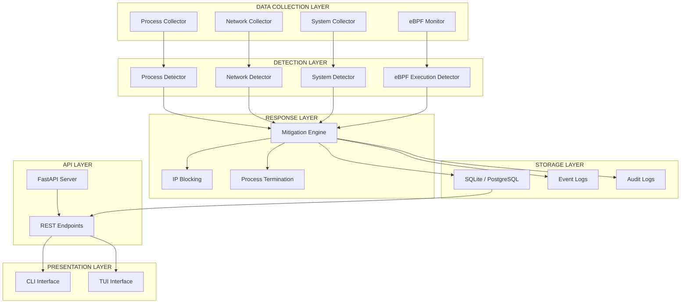
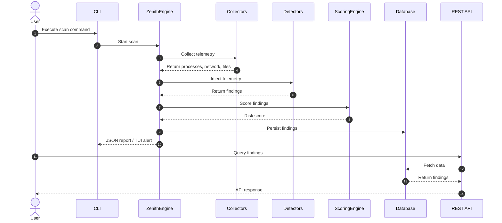
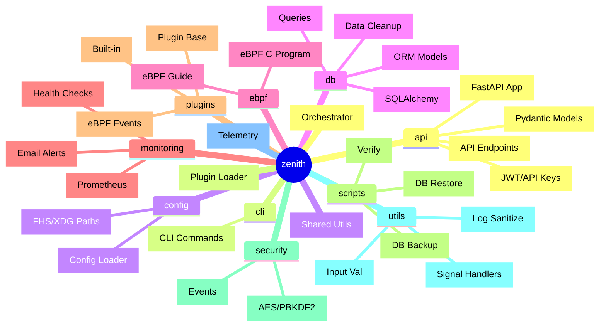
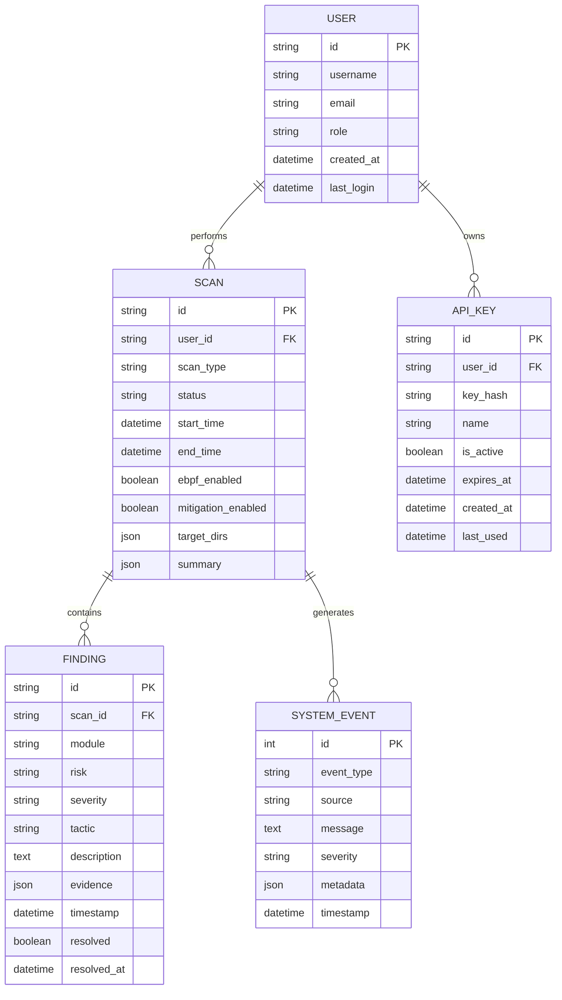
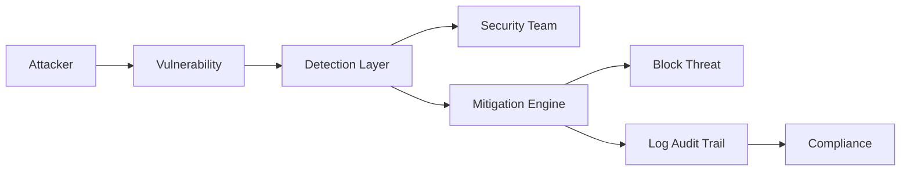
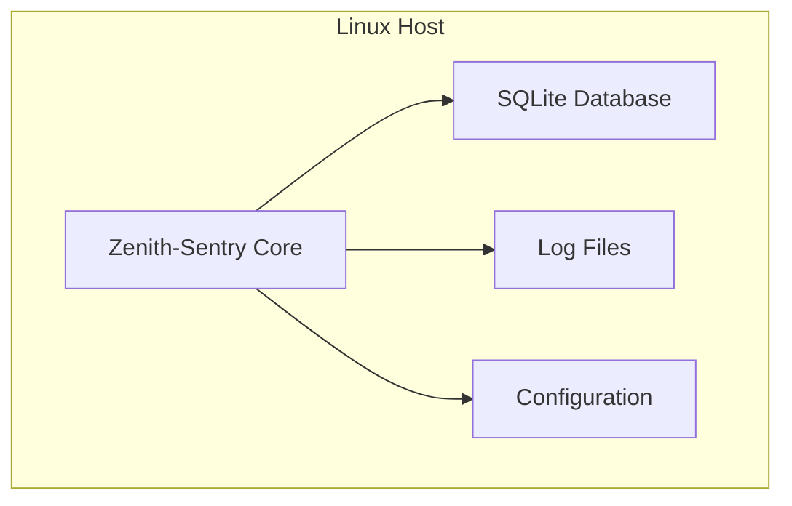
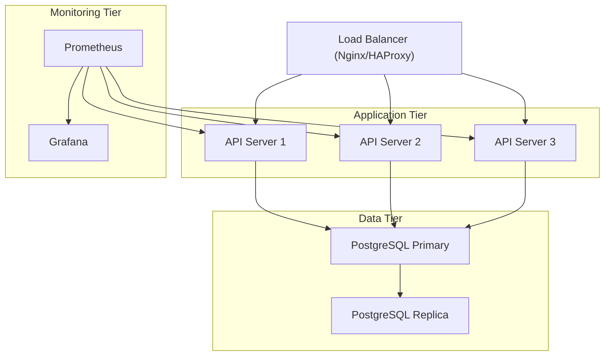
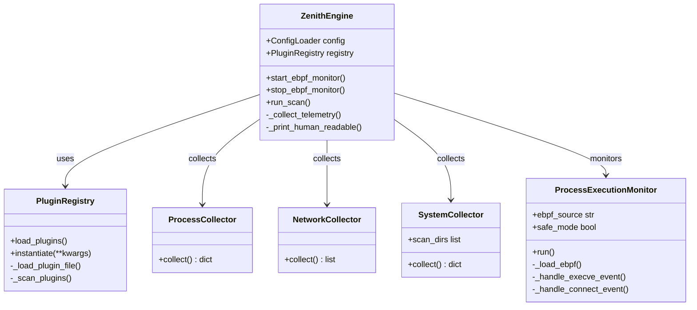
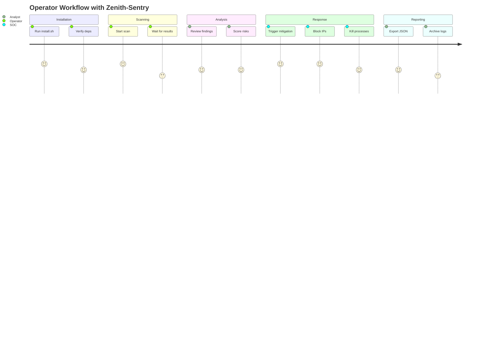

# Zenith-Sentry Architecture

This document provides a comprehensive overview of the Zenith-Sentry system architecture, including component design, data flow, and deployment patterns.

## Table of Contents

- [System Overview](#system-overview)
- [Component Architecture](#component-architecture)
- [Data Flow](#data-flow)
- [Module Structure](#module-structure)
- [Database Schema](#database-schema)
- [Security Architecture](#security-architecture)
- [Deployment Architecture](#deployment-architecture)
- [Performance Considerations](#performance-considerations)

## System Overview

Zenith-Sentry is a Linux Endpoint Detection and Response (EDR) tool that provides real-time security monitoring, threat detection, and automated response capabilities. The system is built with a modular, event-driven architecture that ensures high performance and scalability.

### Key Design Principles

- **Defense in Depth**: Multiple layers of security controls
- **Behavioral Analysis**: Focus on behavior patterns rather than static signatures
- **Kernel-Level Visibility**: eBPF monitoring for tamper-proof telemetry
- **Modular Architecture**: Plugin-based detection system
- **Production Ready**: Built for reliability and scalability

### System Architecture

## Component Architecture

### Core Components

1. **ZenithEngine** - Main orchestration engine that coordinates all components
2. **Collectors** - Gather telemetry data from the system
3. **Detectors** - Analyze telemetry for security threats
4. **Mitigation Engine** - Execute automated response actions

### Data Flow

### Module Structure

### Database Schema

## Security Architecture

### Defense in Depth

1. **Input Validation** - All inputs validated before processing
2. **Command Injection Prevention** - Parameterized commands, IP whitelisting
3. **Secure Signal Handling** - Safe signal handlers with proper cleanup
4. **Encryption at Rest** - AES-256 encryption for sensitive data
5. **Secure Logging** - PII redaction, security event correlation
6. **Authentication** - JWT tokens and API key authentication
7. **Authorization** - Role-based access control (RBAC)

### Threat Model

## Deployment Architecture

### Single-Node Deployment

### Distributed Deployment

## Performance Considerations

- **Memory Management**: Circular buffer for eBPF events to prevent memory leaks
- **Database Indexing**: Indexed queries for fast lookups
- **Connection Pooling**: SQLAlchemy connection pooling for database efficiency
- **Async Processing**: FastAPI async support for concurrent requests
- **Data Retention**: Automatic cleanup of old data to prevent database bloat

## Class Diagram

## User Journey

